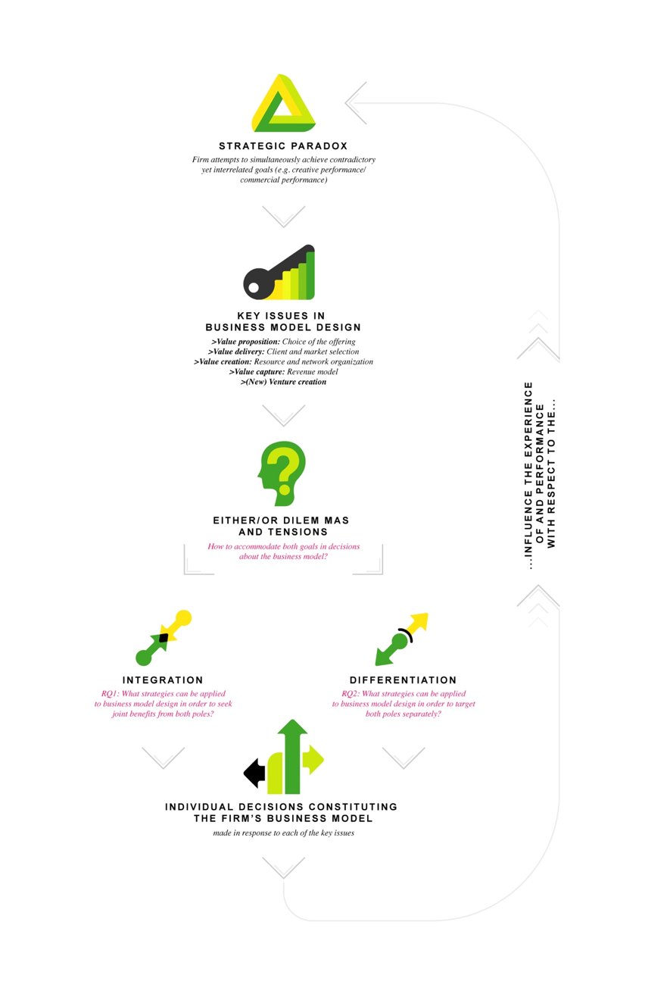
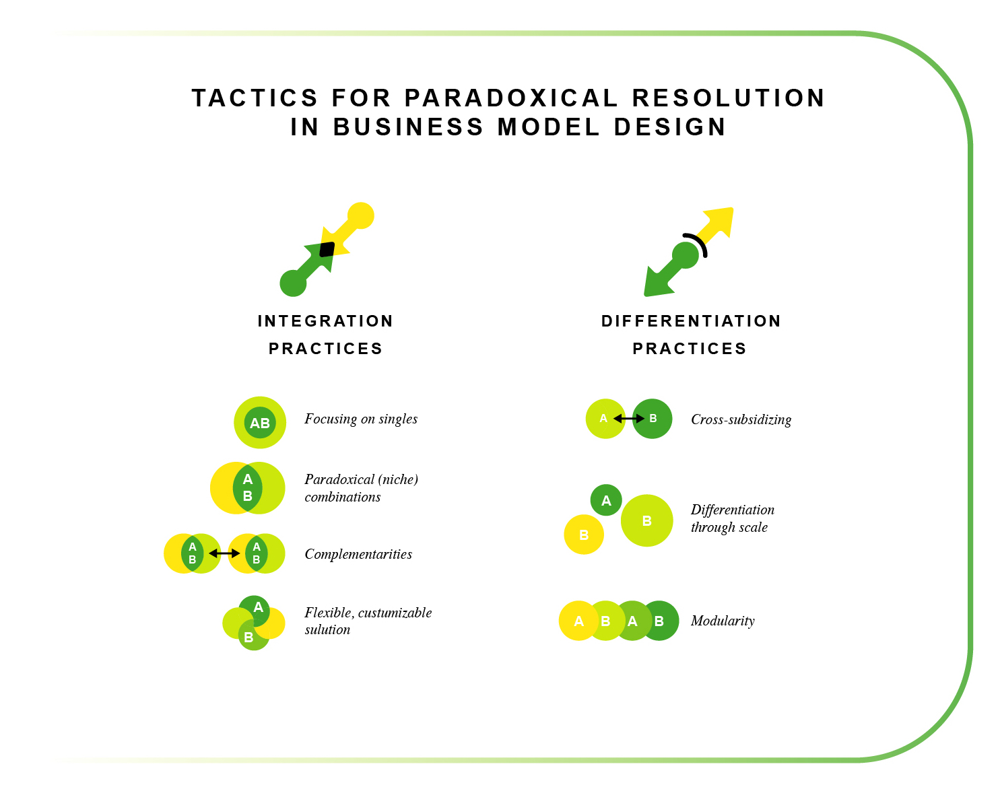

# *CRAFTING* BUSINESS MODELS FOR PARADOXICAL GOALS: {#paper1}   
**LESSONS FROM CREATIVE SERVICE FIRMS**

>> **Abstract.** Senior managers attempt to design the best possible business models that would enable their firms to reach their targets. Yet, as the entrepreneurial complexity increases, leaders have to consider conflicting, even paradoxical strategic goals in their decision-making, if they want to succeed. Examples include profit and social value, stakeholder and company interests, exploration and exploitation, sustainability and economic returns. How can managers create such business models able to accommodate these conflicting needs? We study creative firms who face the double-success criterion - the imperative to perform well both creatively and commercially - to show how organizations use business model design as means of simultaneously achieving conflicting goals. We leverage paradox literature to map the diverse ways in which firms use integration and differentiation strategies across different business model domains: types of services provided, choice of clients, networking and resourcing practices, revenue models and new venture creation. Based on our qualitative case analysis, we introduce four integrative and three differentiating strategies that firms can apply in their decision-making about business model design when exposed to conflicting strategic demands or success criteria. Our findings contribute to the ongoing scholarly debate about paradox management by suggesting new ways of working through the paradox. Our results equally enrich the business model literature by showing how to craft business models capable of catering for double agendas.

**Keywords:** business models, paradox management, creative industries, service firms. 

## Introduction  

> >"Two souls, alas, are housed within my breast, And each will wrestle for the mastery there."
       (Goethe. Faust, Part One: "Outside the city gate.")
  
In the past two decades, business models have attracted considerable scholarly and entrepreneurial attention, seen as a new source of competitive advantage and an additional innovation domain [@Massa2017; @Ricart2011]. A business model is the design by which a firm operationalizes its goals into specific decisions that create value and establish mechanisms to capture this value [@Massa2017; @Morris2005; @Smith2010]. While designing a commercially successful business model is not an easy task [@Teece2010], it is arguably even more difficult for organizations that aim to create and capture more than economic value, such as social enterprises, creative firms, hybrid organizations, state companies or family firms. Such firms face complex demands and pluralistic institutional logics, which require them to pursue conflicting, even paradoxical, goals at the same time [@Ocasio2016; @Yunus2010].   
  
In fact, paradoxical - conflicting, yet interrelated and persistent - goals are not restricted to particularly salient settings as the ones mentioned alone [@Jarzabkowski2006; @Jarzabkowski2013]. Almost all firms have to simultaneously think about their long- and short-term interests [@Slawinski2015], learn and perform [@VanDerVegt2005], explore and exploit [@Gupta2006], or increase profits and be socially responsible [@Smith2012]. Paradoxical goals are hence an inevitable reality of most contemporary enterprises [@Jarzabkowski2006]. Such goals compete for organizational resources and attention [@Smith2014], whereby operationalizing them for successful value creation and capture requires complex business models [@Smith2010]. Yet, despite the prevalence of contradictory demands, there is very little research on how firms deal with conflicting goals in their business modelling efforts.  
  
Thus far, an explicit link between paradoxical demands and business models has been made only conceptually [@Smith2010; @Ocasio2016]. Empirically, some separate practices have been identified in the social entrepreneurship literature, as well as discursively in the paradox literature. For instance, @Yunus2010 have pinpointed the need of finding partners for complementary resources, selecting shareholders with similar dual mindsets, or defining the expected social profit and how it is gained. Paradox scholars have repeatedly shown that such business model related choices as venture separation [@Burgers2009], client segmentation [@Andriopoulos2010], and value chain integration [@DeFillippi2009] can be used as means to cope with conflicting goals. However, this area lacks more systematic empirical insights and theory building.    
  
This paper addresses this gap to explore how firms use business model design as means to manage conflicting goals simultaneously. We adopt a paradox lens to the plurality of and contradictions in firm goals. Our conceptual model builds on the *dynamic equilibrium model of organizing* introduced by @Smith2011 and @Smith2014. According to this model, strategic paradoxes create tensions, which have to be accepted and 'worked through'. Paradoxical resolution requires "confronting paradoxical tensions via iterating responses of splitting and integration"[@Smith2011, p. 389]. In paradox theory, these integration and differentiation (or separation) strategies are thus seen as the generic responses for coping with conflicting goals; and their application has been discovered and discussed at many levels and domains of management and organization but not at the business model level (for recent reviews see @Schad2016 and @Fairhurst2016). We leverage this model to study how these strategies are applied to business model design as means of managing paradoxical goals.  
  
For our investigation, we carried out an inductive cross-case analysis based on interview data with founders and/or managers of Dutch creative service firms (e.g., design consultancies, advertisement agencies, digital agencies). We chose the creative industries setting as a typical paradoxical setting. Creative firms face the *double success-criterion*  [@Jacobs2012; -@Jacobs2013] - their capacity to generate profits and sustain business depends on the willingness and ability of the employees to constantly be creative and generate novel solutions; and vice versa - the continuous engagement in creative and challenging work depends on the financial sustainability and efficiency of the enterprise [@Jones2015; @Lampel2000]. Our analysis reveals how senior managers work through the paradoxical tensions associated with simultaneously pursuing creative and commercial goals using four kinds of integration and three kinds of differentiation tactics across different aspects of their business models. Based on the results, we 1) construct a more complete picture of the menu of business modelling and decision-making alternatives  [@Chesbrough2002] available for firms in pluralistic settings; and 2) discuss the ways in which firms can implement combinations of both types of paradoxical business modelling tactics in their decision-making to minimize the tensions arising from pursuing conflicting goals.    
   
The remainder of the article is structured as follows: we first review the literature on strategic paradoxes. We then discuss business model design and how insights from paradox theory can be used to frame this process as an organizational response to conflicting goals. The subsequent section outlines our research design and methods. Finally, we present our results and discuss them in the context of prior studies on paradox management and business models.  
    
## Literature review    
### Coping with strategic paradoxes    
To understand the workings of business model design as a response to conflicting goals, we should be able to rely on the existing knowledge about organizational responses to conflicts. While many literature streams have dealt with the topic, thus far, paradox theory [@Lewis2014] provides the most elaborate insights when it comes to theorizing about the decision-making responses. Paradoxes are defined as "contradictory, yet interrelated elements of organization that seem logical in isolation, but inconsistent and oppositional in conjunction and persist over time" [@Jarzabkowski2013, p. 245]. As the definition suggests, there are three key features of a paradox: contradiction, interdependence and pertinence. Like Yin and Yang, paradoxes consist of two mutually reinforcing, yet opposing poles or elements that interact in a conflicting whole, or "eternal mutuality" [@Schad2016, p. 6].
  
According to paradox scholars, many organizational phenomena can be framed as paradoxical, for instance, tasks, demands, identities, cultures, and also goals [@Smith2014]. There are various types of paradoxes, each having different sources. The conflict of the creative service setting we are studying, namely, the imperative to be creatively and commercially successful at the same time can be seen as a strategic paradox, or what can be also described as a *paradox of performing* [@Smith2011]. Such paradoxes come about as a result of multitude stakeholders and competing goals, and surface tensions as the individuals struggle to carry out conflicting tasks and roles simultaneously [@Jarzabkowski2013; @Luscher2008]. Strategic paradoxes are particularly dominant and influential for they penetrate the whole organization and jeopardize its ability to sustain itself in the long-run [@Jarzabkowski2006; @Smith2014]. The success of firms that face strategic paradoxes will thus depend on their ability to respond by accepting the paradoxes and learning how to cope with them. In line with the theory, the traditional trade-off approaches that imply choosing one or the other pole are not suitable for coping with paradoxes, as they cannot be resolved. Managers should instead adopt a "both/and" mindset, recognizing the duality and the necessity and interrelatedness of both (or all) poles [@Lewis2014]. The paradox literature also offers specific management strategies for grappling with such challenges.     
  
@Smith2011 have synthesized prior research and theoretical insights into a *dynamic equilibrium model of organizing*, which has been further applied to the particular case of strategic paradoxes [@Smith2014]. According to their theoretical model, some organizational strategies require simultaneously targeting juxtaposed, yet interdependent goals. The paradoxical nature of such strategies implies that a choice between A and B cannot be made, as both are regarded as important, yet the fundamentally opposite decisions necessary to act upon each of them are conflicting and cause tensions. Due to the persistence of the conflict between the two poles, the process of paradox management can be seen as a continuous circle of organizing and decision-making, where decisions on how to organize for and manage the paradoxes lead to either virtuous or vicious patterns. If the managers choose to ignore one of the two poles, this eventually leads to vicious circles, where the ignored pole resurfaces unresolved tensions. If the dual nature of the strategic context is accepted, virtuous cycles spur as managers work through the tensions, by implementing a decision-making process that accommodates both A and B [@Fairhurst2016]. As specified by the model, all decisions in management and organization can either address the paradoxical goals separately by applying differentiation approaches, or simultaneously through integration approaches [@Smith2011; @Smith2014].  
   
*Differentiation approaches* to paradox management can entail spatial or temporal separation. Spatial separation prescribes dealing with tensions through segmentation and/or source splitting, for instance, establishing separate units, teams, ventures, leadership structures, processes, etc. Temporal separation or vacillating focuses on segmentation over time instead of splitting structures and processes "in space"[@Poole1989; @Fairhurst2016].  
  
*Integration approaches* imply searching for compromise in terms of solutions that embrace both poles [@Fairhurst2016], for example, hiring all-around employees that adhere to both visions [@OReilly2013], or that have multi-sided skills [@Gotsi2010], creating an organizational meta-identity that unites both poles [@DeFillippi2015], or building common organizational value system through communication of the dual strategic goals [@Kolsteeg2014].  
  
According to @Smith2014, each approach is needed for successful paradox management. Differentiating approaches stress the unique characteristics of each pole, while integration approaches emphasize synergies and connections. If companies manage to successfully implement "consistently inconsistent decision-making patterns" [@Smith2014], shifting between integrating and differentiating in a balanced way, this can lead to sustainable firm performance in the long-run, using the tensions as a source of creativity and driving force to eventually even achieve continuous strategic innovation [@Tse2013]. 
  
As shown in the examples, both approaches of paradoxical resolution have been studied with respect to many domains of strategic decision-making and beyond. While scholars have further argued that firms facing strategic paradoxes require complex business models [@Smith2010], we know very little about what that actually entails.   
  
### Business model design 
Business models can be broadly defined as descriptions of how firms create, deliver and capture value [@Osterwalder2010; @Teece2010]. The business model perspective has emerged as an alternative way of conceptualizing and describing how firms do business [@Magretta2002] when compared to the more traditional resourced-based or strategic positioning views. As a perspective, it adds the previously absent demand-side considerations to explain firm heterogeneity and performance differentials [@Massa2017], and promotes "voluntary choices over environmental conditions" [@Demil2015, p.2]. 
  
In order to understand what business models are, scholars often first explain what business models are not. As @Morris2005 summarize, "[the business model] captures key components of a business plan, but the plan deals with a number of start-up and operational issues that transcend the model. It is not a strategy but includes a number of strategy elements. Similarly, it is not an activity set, although activity sets support each element of a model." (p.727) It should also not be confused with revenue models, as they form only one of the business model decision domains. A key characteristic of the concept is that it captures the essential strategic choices that explain how firms do business.  
  
In a similar vein, this article adopts the definition of @Smith2010 where "[a business model is] the design by which an organization converts a given set of strategic choices - about markets, customers, value propositions - into value, and uses a particular organizational architecture - of people, competencies, processes, culture and measurement systems - in order to create and capture this value" (p.450). According to this definition, the business model manifests as a set of choices that all together shape the firm's business model  [@Morris2005]. In line with the definition, most literature agrees on distinguishing four separate, yet interrelated choice domains of business model design that facilitate the analysis:  
  
- *Value proposition* describes the basic features of the offering, the type of value it is generating and the perceived basis of differentiation from competitors.  
- *Value delivery* describes the demand side or the customer infrastructure that the firm builds - its target markets and customers to whom the value is delivered; how they are acquired and reached.    
- *Value creation* depicts the supply side of the firm, namely, what internal and external resources, activities and structures are needed to generate the value proposition.  
- *Value capture* describes the financial aspects of the firm's value mechanisms [@Morris2005; @Osterwalder2005; @Teece2010].  
  
In short, business models help managers to answer four major strategic questions - what do we offer; to whom; how do we make sure we have all we need to create our offering; and how are we paid? By making decisions in each of these four domains managers continuously design their firms' business models. 
  
Management literature has repeatedly emphasized that designing a good business model is essential to firm performance and can give substantial advantages over competitors [@Zott2007].  As explained by @Casadesus2010, "different [business model] designs have different specific logics of operation and create different value for their stakeholders".While most of business models are designed to convert the created value into profits (and hence this has also been the main research focus), we can also extend this notion to the design of more complex business models that strive to reach multiple objectives and that "manage the inherent tensions involved and enable contradictory agendas to thrive at the same time" [@Smith2010, p. 449].   

### A paradox perspective to business model design: Conceptual framework 
@Ocasio2016 suggest that while firms might face similar contradictory demands, they can interpret them differently. This means that firms commit to the different logics in various ways and with different decisions, thereby creating business model heterogeneity. Business model design can thus also be viewed as a managerial response to pluralism and conflicting requirements [@Laasch2017], as opposed to the common conceptualization that sees business models as descriptions of how firms earn money through their value propositions [@Magretta2002].  
  
Empirical insights linking strategic paradoxes and business model design are quite scattered and often implicit. The business model literature mostly deals with strategic dualities in terms of multi-business-model firms. These studies treat business models as ready-made competitive strategies, where the question is if multiple goals are better reached with a single integrated business model or with separate ones  [@BensonRea2013; @Markides2004]. Yet, according to @Massa2017, it remains unanswered how business models and their components differ when modelling businesses beyond profit-maximization?  
  
Some of the strategic choices that we would consider as pertinent to the business model concept, such as the selection of value activities offered by the firm [@DeFillippi2009], networked resource acquisition [@Yunus2010], or client selection [@Andriopoulos2010], have already been studied relying on the paradox lens. These authors have demonstrated that firms use the earlier outlined integration and differentiation strategies as means of coping with strategic paradoxes, proving that the dynamic equilibrium model of organizing [@Smith2011] can be succesfully applied to understanding strategic decision-making. We thus leverage the model and propose that the process of designing business models for conflicting goals can be equally seen as a process of paradox resolution [@Tse2013]. Figure \@ref(fig:fig1) illustrates our adapted analytical model. 
 

```{r fig1, echo = FALSE, fig.cap = 'Conceptual model.'}

```


The general question that stems from the earlier discussion is how to accommodate conflicting goals within a business model? Based on the insights from paradox management, we can expect that the integration and differentiation strategies would also be applicable when making decisions about the four components of business models - value proposition, delivery, creation, and capture. Prior literature has treated business models as a single choice, and thus discussed the contexts under which integrating two business models with different aims in a single venture, or separating them in two ventures would be more beneficial [@Markides2004]. In this study, we treat new venture creation as the last one of the business modelling domains, alongside the four most important within-business-model decision domains - the choice and articulation of the value proposition, the client and market selection, the resource and network organization, and revenue models. In our particular case, we investigate how business model related decisions can help to achieve the paradoxical goals of creative and business success in the creative service setting. Which business model design choices allow coping with the two goals in an integrated manner and which differentiate between the two goals? Applying this model, we use these individual business model level decisions made by managers (grey box in the graph) as objects of observation to inductively derive integrative and differentiating tactics applicable to business model design in general.  

## Research approach and methods  
Since little specific empirical research was available to inform our research, a qualitative, exploratory, cross-case research design was deemed as the most appropriate [@Yin2013]. Throughout the research process we followed the suggestion on the process of theory building from case-study research as described by @Eisenhardt1989, @Gioia2013, and @Cornelissen2017. 
  
### Research setting: Creativity and commerce as a paradox
For the purpose of this study we chose a specific paradox to study, namely, the tension between creativity and money in the creative industries. Furthermore, we also chose a specific sub-sector of the creative industries to focus our investigation on - creative services (e.g., design consultancies, architect offices, advertisement firms, digital agencies, or audiovisual service providers). These firms combine characteristics of several ideal-types of firms discussed in the literature - creative firms [@Caves2000; @Caves2003], professional service firms (PSFs) [@VonNordenflycht2010], and knowledge intensive business services (KIBS) [@Hertog2000; @Miles2012]. This choice was made in order to keep both the aspirations driving firm behavior, as well as business model options comparable, yet diverse enough for the results to be interesting beyond the setting. The human capital intensity of all three types of firms makes the paradoxical tensions similar, while the service component ensures the comparability of organizational designs and decision-making processes. Table \@ref(tab:buschoices) illustrates the most important business model choice domains in creative, and knowledge-intensive service firms, in general. We elaborate on these choices in Appendix A. 
  
Table: (\#tab:buschoices) Main business model choices for creative firms.   
   
| Value Proposition 	| Value Delivery 	| Value Creation 	| Value Capture 	|
|------------------------------------------	|-----------------------------	|-----------------------------------	|----------------------	|
| Knowledge offering: 	| Client and market selection 	| Resourcing choices 	| Revenue models 	|
| Value chain activities 	| Customer relationships 	| Network organization 	| New venture creation 	|
| Service architecture 	|  	| 'Production' process organization 	|  	|
| Offering type (service and / or product) 	|  	|  	|  	|  

Creative service firms mostly follow a very traditional professional service firm business model - they offer a highly customized (innovation) services that are based on a certain type of knowledge that is unavailable to the client [@VonNordenflycht2010]. TThey are mainly paid on hourly basis, and according to the seniority. Human talent is the main resource of the firms, so the leaders have to make sure that the employees are satisfied, challenged enough, and are fulfilling their creative potential, if they want to retain the talent within their organization [@Teece2003; @Caves2003]. Such entrepreneurs are also often not primarily driven by profits, but instead aim to realize aspirations about professional prospects, certain lifestyles, creative self-expression, or meaningful work [@Chaston2008]. These firms cannot benefit from economies of scale through traditional means, neither through digitization, as the knowledge intensity requires a close contact to clients [@Miles2005]. While the firms could decrease customization and hence increase returns to labor hours, that would also change the nature of work and would hence not be in line with the ambitions of employees. This also makes it difficult to exercise more control over the employees, as flexible organizational culture is needed to foster creativity [@Andriopoulos2003]. However, the tensions between creativity- and efficiency-oriented behavior are not only internal. The services have by nature opaque quality - while being their primary source of value, without expert knowledge, the quality is difficult to estimate. Such firms are hence often underpaid, yet need to maintain very high levels of quality, when compared to similar settings, where quality is easier to judge or more professionalization exists  [@VonNordenflycht2010; @Silvestro1992; @Maister1982].  

@Ocasio2016 explain that the extent to which firms will be able to cope with such conflicting demands at the business model level will first and foremost depend on whether they frame and translate them as a trade-off or a paradox. While this is not necessarily the case in all other KIBS, creative industries firms [@Caves2000] have a long-lasting tradition of framing the internal and external conflicts between creative and commercial goals as a trade-off, borrowing it from the arts' world.  
At the industry level, theories divide markets into mass (commercial) and niche (artistic) and argue that different kinds of creative production take place in each [@Bourdieu1993]. Consequently, similarly to the work developed on the generic strategies of competitive advantage [@Porter1985], wwhere firms are thought to compete based on either quality or cost efficiency, it is suggested that creative firms should choose between a commercial or creative-artistic strategy, depending on the markets the want to target [@Canavan2013]. At the decision-making level, creative firms have been found to consistently prioritize professional standards and creative aspirations over monetary value  [@Jacobs2012; @Bos2016]. According to our conceptual model, such trade-off thinking in paradoxical settings means denial and can lead to vicious circles of tensions penetrating the organization and jeopardize its capacity to perform in the long run. Unsurprisingly, research and statistics show that creative firms have low labor productivity, problems with growth, higher than average start-up failure rates, and general problems with financial viability [@Jacobs2013].Nevertheless, similarly to the developments in paradox theory, also creative industries scholars increasingly agree that a clear distinction between creative and commercial activities in the sector is untenable [@Hesmondhalgh2006; @Oconnor2010]. This is especially the case in for-profit creative industries, including creative service firms, where the success depends on being good at both creation and commercialization simultaneously [@Jacobs2012]. It would therefore more realistic to suggest that, while pursuing creative and commercial ends simultaneously creates certain tensions, this co-existence of conflicting, yet interrelated goals can be better framed as an organizational feature that cannot be changed and has to be accepted and managed [@DeFillippi2015; @Lampel2000; @Townley2009], and is hence paradoxical. 

### Case selection, data collection and analysis  
We studied a total of sixteen cases, and their selection for our study was theoretical. The firms in our sample had to be at least 5 years old and with a minimum of 5 full time employees. The age ensured that firms have survived the startup phase and had been able to manage both creative and business goals with relative success. The size meant they are big enough to have developed also organizational values and goals, not only individual ones. In addition, we also asked industry experts to point towards firms with diverse commitments to both logics.  
  
The data was collected primarily in semi-structured interviews. When conceived as a set of decision variables, business models emerge as a result of the decision-making process of top-management. Methodologically, it implied that the founders/managers of the firms were considered as the most relevant informants for our study. The in-depth interviews lasted between 60 and 180 minutes. Three rounds of interviews were conducted, at consecutive points in time, thereby securing that data collection and data analysis overlap, and adjustments can be made. In addition, extra data sources were used for triangulation, such as information from websites, field notes from various public events and presentations, articles in press, and survey answers from a follow up study. Appendix B describes our cases. The analysis can be divided in three consecutive steps.  
  
*Step 1: Discovering the paradox.*   
In the first interviews (n=7), the managers were asked to elaborate on the business decisions that theoretically are considered as pertinent to the business model concept, and their relationship to the values and goals of the firm and entrepreneur in a broader and a more open-ended manner. Similarly to @Andriopoulos2010 and much of the earlier literature outlined before, we actually set out to explore frustrating dilemmas and how business model related decisions are made to prioritize the one or the other pole, only to realize that we are dealing with a paradox. More specifically, the initial hypothesis of the project was that firms can have either a creative orientation or a commercial orientation, and that this will impact how they set up business models (different from each other) and hence determine how they perform creatively and financially/commercially. After having done the first analysis of business models and orientations of each firm, we noticed patterns that invited to reconsider how we understand the interplay between creative and commercial goals. We then adopted a paradox lens, reanalyzed the existing interviews and adjusted the interview schedule. Table \@ref(tab:parexp) illustrates the tensions between creative and commercial organizational goals experienced by the respondents in our sample using quotes for each of the defining features of the paradox. In the last two rounds of interviews (n=9), we asked more specific questions on the paradoxical aspects, tensions, and practices found in the first round. We also asked to elaborate on the changes over time to see how some paradoxes are dealt with over time.        
  
Table: (\#tab:parexp) Experiences of the paradox.   
  
| Features of the strategic paradox                             | Illustrative quotes                                                                                                                                                                                                                                                                                                                                                                                                  |
|---------------------------------------------------------------|----------------------------------------------------------------------------------------------------------------------------------------------------------------------------------------------------------------------------------------------------------------------------------------------------------------------------------------------------------------------------------------------------------------------|
| Conflict                                                      | "I guess in the end design agencies have similar issues, which is in the end selling creativity. It's something that is very difficult. I mean, selling. it's very hard to tell to a businessperson, OK, we need so many days for this project. OK, what are you going to do? I don't know, we might sit in the garden and look at the sky for ten hours, you know. (Case 1)                                         |
|                                                               | 'Look, eventually I lose, if I say: this is only commercially attractive. For instance, we could have worked in Saudi Arabia. Commercially attractive, at least if they pay, but you can earn a lot of money there, if you're good. But we [as an enterprise] simply do not want to work in Saudi Arabia, you know. So I could stand on my head, that's simply not going to happen.'(Case 16)                        |
| Interdependence                                               | [...] in fact, if you look at the advertising [field], the commerce and creation naturally lie close to each other. You're being hired as a creative firm to give creative advise about something that they cannot do themselves. So on creativity. In between you have to listen to them as a service provider. Ultimately you have to keep your client satisfied and that is a terrible scene of tension."(Case 6) |
| Persistence over time                                         | "Money has to be earned and you can call that "commercial". Yeah, I just find it a necessity. One has to earn money, also in creative enterprises. [...] If we concurrently will prioritize commercial gain over creation, then there will be no more beautiful projects. Then you'll be... if you make so unique things as we do, you cannot do that." (Case 11)                                                    |    
    
*Step 2: Business models for paradox management.*     
After having adopted the paradox lens, we conducted another coding round, where we were searching for paradoxical experiences and decisions that allowed firms to cope with the strategic paradox. We looked for emerging patterns (code overlaps) allowing us to frame specific business model choices as responses to conflicting strategic tensions. The findings were used to make a first list of strategies that firms are using for paradox management. We followed the suggestions of @Gioia2013 and the example of @Andriopoulos2009 for structuring conclusions derived from qualitative data in inductive research. In addition, based on the literature, we created a checklist of features that would help to classify a business model choice in terms of integration and differentiation strategies. The following features were summarized:    
  
A business model design decision made according to the *integration approach* addresses both strategic goals (in our case creative and commercial goals) simultaneously. It aims to bridge the two poles of the paradox in such a way that they inform each other. This approach is characterized by seeking the middle ground, balance and alignment in the system.  
  
A business model design decision made according to the *differentiation approach* addresses both strategic goals separately at different moments in time or using separate structures. It focuses on enabling both by segmentation, either creating separate systems, or shifting and oscillating between the poles. It does not include design solutions where only one of the goals is attended, as that would be consistent with a trade-off approach.  
  
*Step 3: Comparing cases and theory building.*   
We used the developed descriptions to construct a deductive coding schedule with codes for both paradox management strategies. The aim of this coding round was three-fold: 1) to generate a list of integration and differentiation practices for paradox management through business model design, and 2) to assign cases to the specific paradox management practices, enabling cross-case comparison. The exhaustive list of integration and differentiation strategies we generated was then discussed with an expert group consisting of three other scholars in related fields and four representatives of the industry in order to select the most important strategies to focus our result discussion on. We compared cases to seek patterns for further theory building (Appendix C). The analysis resulted in a final list of four integration and three differentiation tactics applicable to business model design choices for resolving paradoxical tensions. We discuss them in the next section.   
  
## Findings: Designing business models for paradoxical goals
> >'The balance is never there. You're always looking for the balance. There is a very beautiful drawing of a seesaw. Do you know what a seesaw is? [...] You have to draw a bag of money here. With a dollar sign, very good. And a heart there. So you are looking for the balance. If there's too much heart in it, you're earning too little money. If you earn too much money, there's not enough heart in it.'(Case 10)  
  
As this quote illustrates, the leaders in our setting are aware the fact that their economic activity is embedded in and results from two opposites, which require the act of balancing. We focus on how this paradoxical thinking is enacted when making within-business-model design decisions. In our analysis, we were looking for the application of integrative and differentiating considerations upon the decision-making process across all the business model choices outlined in Table 1. Are they made in a way to address both creative and commercial goals simultaneously or separately? Based on these decision-specific insights (Appendix C), we extracted the seven tactics (Figure \@ref(fig:fig2)) that were used across the different domains. We first discuss the four tactics pertinent to the integration approach and how they are used in business modelling; we then proceed to the differentiation tactics.  

```{r fig2, echo = FALSE, fig.cap = 'Tactics for paradoxical resolution in business model design.'}

```

### Integration tactics  

According to the literature, integration approaches aim to find ways in which the two poles of the paradox can inform each other. Integration aims at merging of the best sides of both, seeking the middle ground and alignment. Hence, decisions that can be classified as integrative with respect to our paradox have to result in simultaneously contributing to innovativeness, quality, and efficient commercialization. The patterns across our cases reveal four decision-making tactics that can be described as integrative - focusing on singles, developing paradoxical niche combinations, seeking complementarities, and implementing flexible solutions (see Table 3 for an overview of findings).  
  
#### Focusing on singles 
  
The first integrative tactic used by our firms could also be labelled as "keeping it simple." This tactic entails making very simple business model design decisions - defining simple value offerings, providing services at only one part of the value chain, maintaining a strict service logic, targeting specific, well-defined markets and client segments, or using simple, mostly traditional revenue models.  
  
When applied to value proposition design, for instance, this tactic resulted in specializing in providing services in a single domain (e.g., spatial design, brand and communication, or advertisement), or even more specific services from a particular domain (e.g., exhibition design, website development). Such value propositions are quite easy to pinpoint, such as "we are a small design agency specialized in brand and packaging design." The same approach was also applied to the value chain activities that are included in the value proposition by firms" choosing only a single part, mainly the creation phase, as the offered service.  
  
Focusing on singles also came about as a strategy to cope with the creativity-commerce tensions among the firms that chose to keep their business strictly to a service offering, not even considering offering products. More precisely, the firms did so by avoiding the introduction of two "side-effects" of productization - complexity and increased attention to marketing and sales, which could cause a misbalance in the focus of the firm in favor of the financial side. The following quote illustrates the ways in which a service logic (and focusing on singles, in general) helps to focus on full integration of creative and business activities:  
> >'We've got our services business, and we just sell our [services]. A lot of people asked me over the years, 'Don't you want to make a product yourself, which is scalable and which can grow and which you can sell to thousands of people?'[...] We have a lot of ideas all the time but if you are doing projects, it's really hard to mix it with the products. Because if a [service] client calls, then everybody's getting off their own products, and everybody goes to work for the client. Then this product dies, and you pick it up and you're too late.' (Case 15)

The same tactic was also applied to the choice of revenue models. The interviewee from one spatial design agency explained:  
> >'We have a very simple revenue model, actually. We say - an hour factory. We live from the honorariums of our clients. And we never earn anything from the materials of execution of the projects of our clients. [...] We want to have the purely creative part as our product. We always work with suppliers that are contracted by our client, not us. That is our business model." (Case 5)
  
All in all, although it might appear counter-intuitive that a focus on singles could help to accommodate a dual strategic paradox, applying this approach to any of the business model decisions minimizes the requirements needed to implement them, whether it would be in the service content, resourcing, or other domains, contributing to undivided organizational attention. It consequently allows firms to focus their attention on making sure that their offering is both of high creative quality and brings in enough money. Nevertheless, firms using this overusing this tactic might rely too much on the industry standard business models " specialized creative knowledge offering, where a lot competitors do the same, and working based on hourly rates making it difficult to negotiate rates and account for all the hours invested, thereby decreasing profitability.   
  
#### Developing paradoxical niche combinations  

The second integrative tactic throughout the business model entails paradoxical merging -  making decisions in such a way that they combine the best of the two paradoxical poles, using paradox as a source of advantage. Contrary to the "seeking complementarities" tactic discussed further, which uses external possibilities as source for an integrated paradoxical resolution, this tactic relies on internalizing integration. Among the firms in our sample, this tactic was mainly applied to value proposition design, resource acquisition choices, and sometimes market selection decisions, although it could equally be applied to revenue models.  
  
For value proposition design, developing niche combinations prescribes merging different knowledge kinds, activities, or offering types, where each represent one of the paradoxical poles, into a single value proposition. For instance, in addition to concept creation, a company would also take care of some of the executive or marketing-strategy parts. They would emphasize the combination in their service description, yet never offer them as separate value propositions.  
  
The combination tactic was equally applied when making resource acquisition decisions. In our analysis, we categorized in-house resourcing as an implementation of this tactic. It entails that all the important resources needed in order to deliver the value proposition - both creative and business ones - are "owned" by the organization and that the organization carries out the activities on its own. In-house resourcing brings both poles together by creating an alignment between what is offered to the client and what the firm can do itself. Not only does it create a context for bridging the paradoxical identities in a single firm, but also gives more control over the execution of the business. As explained by the managing director of a spatial and interactive communication design agency who have also the production resources in-house:  
  
> >"Many firms in the creative sector do either only concept development or prototyping, but definitely not the production, but I think exactly if I know a lot about production and have a small core team of that [...], then I can do it a lot quicker and better, and I keep control over the end result. And I consider it really important, that it turns out really well." (Case 11) 
  
While less apparent, this tactic was also often used when choosing markets and clients. Since the creativity-commerce paradox most often manifests as an inability to prioritize profitable work (and hence clients) over creatively challenging work and vice versa (Bos-de Vos et al., 2016), firms applying the niche combinations tactic deliberately chose to work only with clients that bring returns for both paradoxical strategic goals.   
Developing niche combinations is the tactic that most obviously allows firms to thrive on paradoxical synergies, as it brings together both paradoxical poles in a merged decision. The downside, however, is that niches limit the scope of the firm"s activity to something rather specific. This makes firms often struggle with finding enough clients, markets, and opportunities.  
  
#### Seeking complementarieties  

Another tactic, which brings both poles together, we labelled as "seeking complementarities." Contrary to the previous one, this tactic is based on searching for support for the paradoxical business model externally to the firm. It prescribes finding external complementary solutions that take source in similar paradoxical strategies yet can support the business model of the focal firm with complementary assets or structures. 
  
One such application among our firms was that of establishing collaborative networks. Prior research in social entrepreneurship has already suggested how establishing collaborative networks can help the double agendas to thrive [@Yunus2010]. What we identified as collaboration among our cases is based upon the idea of "shared decision-making", as opposed to outsourcing the commercial, and less interesting, parts to a supplier network. The managers that used this tactic in resourcing decisions did not attribute particular creative, commercial, or executive roles to different parties with whom they had established relationships. Instead, these collaborative networks attracted partners with similar vision, but complementary assets, enabling co-creation.  
  
This approach was particularly common in the context of complex discipline-spanning value propositions. As emphasized by several interviewees, the development of certain services and products is becoming increasingly complex. Only simpler propositions can be created without collaboration. The complex ones need a network of knowledge that takes shape depending on the project and is impossible to contract on stable terms with adequate returns on resource acquisition. A partner of a product design agency explains:  
  
> >" It's more about collaboration than outsourcing. [...] I have a broad network in that field so I just pull in parties. Not as a subcontractor, as a partner. Because as a subcontractor you're still on a risk, it's your risk, if they fail. [...] It's about sharing risk, sharing knowledge, but also sharing profits, sharing success." (Case 7).  

This tactic was also found to be a common way of dealing with the creativity-commerce paradox at the venture creation level. Instead of having separate cross-subsidizing ventures where one would take care of the creation part and the other of the product and marketing part, the ventures that followed this approach, spun out as similar, yet complementary services. In such cases, both ventures worked based on the same values and principles and equally embraced the paradoxical goals. Most of the times these ventures offered services that could be included in the same projects but did not form a combined value proposition (i.e., were complementary). Examples are interactive design and back-end development, as well as spatial design and audiovisual services. This approach provides the firms with more work, as they can be each other's clients, yet it does not mix up their value proposition. This tactic integrates the paradox in that it gives more influence over the creative content and at the same time provides firms with the possibility to diversify their revenue streams. The founder of a spatial design agency specialized in retail design explains this approach:     
  
> >"Company B is a part of our enterprise. If you're talking about retail design, then it entails communication, branding and positioning. Where actually the whole branding, brand development is seen as a sort of core activity. There is a gray area between advertisement and communication. What happens in the store, happens in the world. With all the online [developments]. Then you're talking increasingly about the whole customer journey. A brand has a number of contact points with points with the client. It is the store itself, bet also the webpage or the app. You name it. The story that you're telling there, you're not only telling in the store, but at all those points. If we want to be a specialist also in that, then we need our own PR and communications agency. We have worked with other agencies in the past but that was difficult. In the end, we wanted to have our own communications agency." (Case 5)  

#### Implementing flexible structures  

The final integrative tactic that was applied to business model decisions by our respondents was that of implementing flexible structures. The most apparent application was found at the level of service architectures. Fluid value proposition enabled through full customization were used as means of bridging creative and commercial aspects in an assimilating whole. Such paradoxical customization involved treating each project as unique. Firms admitted to defining the specific services delivered only after engaging with the client; no prior rules were set and the very process was adapted as needed. The project terms and rules in a paradoxically flexible service delivery are constantly fluctuating, accommodating both creative and business elements in a non-discriminating manner. Several interviewees revealed that such an approach helped them to mitigate the tensions as the firms embraced the integrity of the project process from the beginning to the end. This allowed them to create a space to negotiate whatever was needed to meet both the needs of the client and the firm - creatively, as well as business-wise. Moreover, not only does it give space to rule negotiation, but the approach also elevated the feeling of repetitiveness:    
  
> >'You know, we don't want to be a one-trick-pony, so in that sense we want to do every project, even though the project shares some resemblance with another project, we want to do it anew, and start from the beginning again. So that's one of the biggest aspirations, we want to innovate.' (Case 1)   
  
Table: (\#tab:int) Summary of findings for integration tactics.    
  
| Tactics | Description | Advantages | Disadvantages | Examples and quotes |
|----------------------------------|------------------------------------------------------------------------------------------------------------------------------------------------------------------------------------------------------|--------------------------------------------------------------------------------------------------------------------------------------------------------------------------|---------------------------------------------------------------------------------------------------------------------------------------|------------------------------------------------------------------------------------------------------------------------------------------------------------------------------------------------------------------------------------------------------------------------------------------------------------------------------------------------------------------------------------------------------------------------------------------------------------------------------------------------------------------------------------------------------------------------------------------------------------------------------------------------------------------------------------------------------------------------------------------------------------------------------------------------------------------------------------------------------------------------------------------------------------------------------------------------------------------------------------------------------------------------------------------------------------------------------------------------------------------------------------------------|
| Focusing on singles | Making such decisions that only entail choosing a single aspect to focus the organizational attention and resources to. | Minimized complexity, low resource requirements, clear external communication of what the firm is doing, undivided organizational attention, low risk. | Low entrepreneurial returns, little room for radical innovation, restrictive, reduced markets. | E.g. focusing in service delivery:,'No, we don't do our own products. That is a whole different kind of 'sport'. [Even if you do], your success is also not guaranteed. If you do want that, you immediately have to do 5 or 6 products, but, yeah, only one or two succeed." (Case 3) |
| Niche combinations | Making decisions so that the solution originates from uniting the best aspects of both poles of the paradox internally to the organization. | Integrity, unique solutions based on a paradoxical vision, clear criteria for decision-making. | Reduced markets, unused resource and skill potential. | E.g. developing creativity-based value propositions in traditionally commercial markets. "We strongly believe in live communication as the communication means for enterprises to do business.,[..] If you ask us, the live contact in industry markets, events, or showrooms has a crucial role in doing business.,['] 'Affection' is a strong and important word in this world dominated by excel sheets. ['] That is our niche. We try to increase the connection between our clients and their clients through creating interesting environments where people feel at ease.,['] Our competitive environment is dominated by marketing companies and stand constructors. ['] If we tell someone that this is a design domain, they're like: 'Wow, I didn't know'." (Case 8) |
| Seeking complementarities | Making decisions so that the solution involves integrating actors, resources, or structures external to the organization. | Learning from the experiences of the like-minded, reduced possibility of conflicts due to similar mindsets and orientations, integrity, extended scope of opportunities. | The chance of missing essential components needed to run the business model, due to overspecialization, more complex management. | E.g. finding partners with similar vision,and specialization, but different skills:,"Interviewer: Have you ever tried to,fully commercialize your own products? Interviewee: Yes, we tried. We,miserably failed.[...] We learnt that, let's say, being a good product,developer doesn't mean that you're a good salesman. [...] we've learnt that,if we jump into a project, if we participate, then a couple of things have to,be in place.,You have to know your,technology partner. We don't do electronics, so we need to know who's going,to do the electronics and if they're capable of doing this job. And the same,,usually it's like a trial, the third party is the party that's going to take,it to the market. Are they capable of actually selling this product? I've met,so many people saying: "I'm going to sell this." And then yet they,don't. So, do they really have access to the market that you're targeting? Do,they have a good reputation? Do they have the sales people on the road? Do,they have the money to spend on advertising, on the right things? And if you,don't trust them, you don't do it." (Case 14) |
| Implementing flexible structures | Instead of focusing on the specific single decisions, awareness of both paradoxical goals is created, yet the decision-making is reactive and customized, depending on the specific problem at hand. | More power to shape processes, less confrontations and conflict possibilities, co-creation and co-ownership of decisions. | Uncertainty, lack of rules, bigger chance of misbalance if one of the paradoxical al goals is in general favored by the organization. | E.g. creating a flexible project management process where there is room for introducing changes: "If you notice - well, I thought it would go this way, but now I actually find this important, then you can still influence that process. So, you're not going to say already in the beginning what the output will be, you're only telling - this is the input, that's the content, and I want a website out of it, but how it looks like, or how you're going to do it, that we're going to discover together, and within a time frame you're going to take small steps. And that works out very well for us, because, yeah... we don't have to promise all things in the beginning, when we don't know if that really will be so. The requirements are less important. And second, also because it's more creative, and you are way more aligned with the client, more like partners - OK, we have this challenge and we have so much time, let's make the best out of it."(Case 4) |  
  
### Differentiation tactics  

Differentiation approaches to paradoxical resolution, according to literature, aim at making separate decisions and implementing separate structures for satisfying the different purposes or poles of the paradox. The focus of such approaches is at keeping the two poles away from each other in order to avoid conflicts, yet still acting upon both. We discovered three such differentiating tactics that managers use in the process of designing their firm's business model: cross-subsidizing, differentiating through scale, and implementing modular structures.   
  
#### Cross-subsidizing  
  
The first differentiation tactic is that of cross-subsidization. This strategy entails structuring assets and processes in such a way that one set of them ensures creative returns, and the other - financial ones, and the totality of them make sure that both are reached. The most common examples of applications can be found at the levels of client segmentation and new venture creation, although it can equally be applied to other business model domains.    

At the value delivery level, firms that apply this tactic choose distinct client segments for each of their strategic intents separately. This means they shift between different kinds of projects. In line with this tactic, certain client groups, markets or project types have different purposes in the business model. In our setting that involved distinguishing between projects for financial and entrepreneurial purposes, and projects that fulfill the creative aspirations. The creative director of an all-around creative agency explained:    
> >"Some projects are really money projects. Some are more for the reputation. For instance, we also work for banks. These are in general really money projects.[...] But the most beautiful is that it sometimes is also mixed, that you get good money for it and it is a really cool project." (Case 3) 
  
In line with the prior literature, we also found this tactic useful for new venture creation. In our sample, new ventures were separated from the core business. These separated ventures would take care of either the more creative or the more business goals. This structural arrangement allows the new venture to benefit from some of the resources developed earlier but enables the employees in the original venture to pay undivided organizational attention to its core value proposition [@Tse2013].The founder of a product design agency told their spinout story:
  
> >"And we also have a spin-off Company B. That is a separate enterprise with different owners where our company is one of them and we do development for them. But they also make and sell products, while we only deliver services. And that is one of the... one of the distinguishing features since we are anyhow connected through our own initiatives. That can sometimes be projects that are only made to improve our portfolio and publicity, and sometimes also ideas that we come up with and would like to sell on the market." (Case 14) 

Furthermore, some of the firms interviewed applied this tactic to *diversify* their service business models by offering products. These firms used a diversified product/service portfolio as a cross-subsidization approach in two ways. Some firms engaged in occasional 'small product' development and marketing as a means to use employee slack time and to motivate them for finding new areas of creative expression and experimentation. Other firms, attempting to make extra profit by turning ideas that they have developed during exploration efforts in service work into marketable products.   
  
The cross-subsidization tactic has obvious benefits in that it allows to tackle both poles without having to limit the scope of possibilities, as it was the case in applying the integrative tactics. However, it also bears some disadvantages, as it requires the attention to both poles to be equally spread over time and "scale". To exemplify, in our research setting, employees do not always equally value the commercial projects as opposed to the creative ones. If there are too many of the first, the employees might lose motivation. While if there are too many creative projects, a company might not be earning enough money. This balance is not always easy to control, when considering the development of a business model over time.  

#### Differentiating through scale  

We labeled the second, less obvious differentiation tactic discovered as 'differentiation through scale.' It entails increasing the overall number of projects, clients, employees, etc., which increases the likelihood that managers pay equal attention to both poles. This tactic was mostly applied to the business model aspects of value proposition design and client choice. For instance, when applied to project selection, firms would increase the size and number of both creative and commercial projects so that the chance of working on the projects that are interesting increases. One of the founders choosing this strategy explains it as follows:  
  
> >"We figured out that, if we want to have more impact as a company because we want to do more innovative products that really have some benefits for people or other things, that's our big goal... we need more projects that might go into that direction. So, we can either focus all projects on that goal, but that's not possible because you always just need volume to do that, and if we have more volume then there is more chance that there is a project that will be in the end that really innovative project."(Case 15)   

Other firms increased the number of activities along the value chain they offer, ensuring that, all together, they achieve their creative or business goals. Others used this tactic to diversify their knowledge portfolios (e.g., "strategy, design and technology" or "design and realization of extremely diverse products and product-service combinations for the brand and market of its clients"). Such value propositions would be intentionally vague and cover a large number of possible offerings, thus requiring also a lot of skills and resources, yet would give the firms the freedom to work on a very diverse set of projects.  
  
#### Implementing modular structures    

The final differentiation tactic applicable to business model design in paradoxical settings according to our findings is that of implementing modular structures. This tactic prescribes dividing the offerings, revenue model structures, or creation processes in smaller pieces or components, where each of the components contributes to one of the paradoxical poles separately. Together the specific smaller components would ensure that both poles are equally attended.  

To exemplify, some firms were using modular service architectures, where additional, less creative-input-intensive elements were introduced to the value proposition. Those elements were not new activities or knowledge, but simply separate components that were repeated over time. This tactic helps to reduce the requirements on creative work to deliver economic value at all times through a structure where some service components have more financial value for the company, and others more creative value. Examples of such components include setting up standardized workshops for client problem definition, maintenance services, repeated services, technical updates, or taking care of print work for brand communications. These extra services were almost never seen as creative content generation, but more as an extra income source. As one managing director of a communication design agency exemplified:  
>>'Yeah, so once [a company] buys a website, then they would [need support] every month... we [would] offer support and come up with new features, and those features and support for our long-term clients make up approximately 50 % of our turnover.'(Case 4)   
  
Another application we found was at the level of resource acquisition. In some cases, firms would acquire all resources in-house, but instead of trying to create synergies among the different units, they would organize them separately, similarly to a profit/cost center approach. The activities would be divided in terms of the creative teams or units, for instance, the creative office, the production unit, etc. They would offer small services by the separate units separately, thereby capitalizing upon the resources that are available to them.   
  
The concept of modularity is being discussed more frequently in the management literature, including the benefits of applying its principles in service firms to minimize the loss of efficiency (and thus money) due to extreme customization [@Voss2009]. Our findings support this idea and further extend it by highlighting the capacity of modular solutions to address paradoxes.  We show that modular solutions can bring together conflicting considerations in a structured and organized ensemble. Among the firms in our sample that implemented a modular approach to their offering and process organization, the paradoxical juxtaposition did not come across as often. Systematization introduced boundaries to the creative efforts required from employees, and at the same time, clearly indicated what financial returns can be expected. But the boundaries were not perceived as constraining; they were described as enabling instead ' defining more clearly the expectation of the type and degree of returns expected from each 'module' of activity. While establishing such structures requires quite some managerial effort, the benefits, as stressed by our respondents, can create more room for creativity, experimentation, and, paradoxically, flexibility.     

Table: (\#tab:dif) Summary of findings for differentiation tactics.  
  
| Tactics | Description | Advantages | Disadvantages | Examples and quotes |
|---------------------------------|-----------------------------------------------------------------------------------------------------------------------------------------------------------------------------------------------------------------------------------------------------------------------------------------------------------------|---------------------------------------------------------------------------------------------------------------------------------------------------------------------------|--------------------------------------------------------------------------------------------------------------------------------------------------------------|--------------------------------------------------------------------------------------------------------------------------------------------------------------------------------------------------------------------------------------------------------------------------------------------------------------------------------------------------------------------------------------------------------------------------------------------------------------------------------------------------------------------------------------------------------------------------------------------------------------------------------------------------------------------------------------------------------------------------------------------------------------------------|
| Cross-subsidization | Making decisions so that dual, parallel systems are created, where separate actors, resources, or structures cater for each of the paradoxical goal separately through shifting over time or in space. | Diversity, efficient resource use, less constraints on separate projects, resources, structures, markets, straight-forward division of roles, hence easier communication. | More complex management, need to make sure the balance over time is in place, lack of overlap and synergies between the two poles, chance of disintegration. | E.g. distinguishing between projects that are for employee creativity and projects that bring in money: 'If I would calculate that back to like an hourly fee, I'd probably go cry somewhere. But those projects are interesting to us [...] It sort of changes everyone's' dynamic. And people here like it. You know, it's nice to suddenly feel like you have to be in a pressure cooker and it also feeds back into the output, I believe. So in that sense I don't mind if those projects are paid a little bit less. Because they are done within a week, we have a lot of creative freedom and they're highly visible.' (Case 1) |
| Differentiation through scale | Making decisions so that the number of available work, employees, resources, or structures is increased so that the likelihood that the totality of them caters for all the paradoxical goals increases. | Integrity, unique solutions based on a paradoxical vision, clear criteria for decision-making. | More complex management, increased resource requirements as the scale increases, balance is not guaranteed. | E.g. increasing the number of projects acquired: 'We figured out that, if we want to have more impact as a company because we want to do more innovative products that really have some benefits for people or other things, that's our big goal' we need more projects that might go into that direction. So, we can either focus all projects on that goal, but that's not possible because you always just need volume to do that, and if we have more volume then there is more chance that there is a project that will be in the end that really innovative project.' (Case 15) |
| Implementing modular structures | Making decisions so that the solution consists of several (parts of) actors, resources, or structures, i.e. components that are organized in a formal system where each part fulfills to the requirements of one of the poles yet can be rearranged and called into action depending on the specific situation. | Diversity, efficient resource use, less constraints on separate projects, resources, structures, markets, more opportunities. | Possibility of creativity loss, if applied too much, complicated structures to implement at the offset. |  E.g. dividing project in phases that are creative and others that can be made more efficient: 'It always has to be commercially feasible-in the way, of course, we have to make a calculation beforehand of how much time we're going to spend. And we aim on doing it in that time, but it is always a fight between quality and time [...]. We can always work more... The limits- and that is actually where we're growing and teaching each other. How the process should be communicated internally. [...] in certain phases, you can be very fast, but that is- you have to know when you do what. That is the commercial approach to- at the end you have to make money and it's very expensive to have a design house like this, with so many people.'(Case 13) |
|     |     |     |     | E.g. defining package-like payment arrangements. "We have made a price menu with small, medium, large, and extra-large option. So [as a client] you can just choose what you find the best. ['], otherwise you're just endlessly negotiating and offering, and I have zero interest in that."(Case 6) |     
   
## Discussion    
Our results proposed seven tactics managers can apply in order to incorporate considerations about paradoxical goals into the business-model-related decisions. The result section illustrated how creative service firms apply these tactics in order to accommodate creative and commercial considerations in their business models. We now proceed to discuss three important implications of our findings - the cognitive nature of business modelling, the interactions between the different tactics, and the applicability of the discovered tactics in decision-making beyond business models.  

### Cognitive business model design under pluralism    
First and foremost, our conceptual framework and findings revealed the cognitive and intentional nature of both business modelling and paradox management. Undoubtedly, business models exist irrespective of the paradoxes that the firms have to deal with; they can be designed to address a paradox, or not. While some business model design choices in the real life might seem as they have been made with the paradoxical aspects in mind because they resemble what has been described in our findings, it is not always the case. For instance, client segmentation can be simply client segmentation, but it can also be paradoxical client segmentation, separating each of the client groups on the basis of their contribution to one or the other goal. In a similar way, we can observe the choice to offer both services and products, yet not in all instances we would be able to link this choice to paradox management.  

This observation confirms the proposition that different interpretations of and commitments to paradoxical goals shape the variety of ways in which firms link business model design and organizational goals [@Ocasio2016]. From an empirical perspective, our findings might not be that useful if one wants to discuss classifiable and observable business models, because we simply cannot estimate without inquiry if a business model decision is made with a paradox in mind or not. However, at a more conceptual level, our results improve the understanding of how business models are cognitively designed by managers using the *components* (choices) that are available to them. This way, the application of paradox lens brings closer together the two traditionally distinct interpretations of the business model concept, namely, business model as attributes, understood as a combination of real life decisions [@Massa2017], and business models as cognitive devices, where those are conceived as malleable configurations in the minds of managers [@Baden2013; @Demil2015].  

### Synergies and pitfalls in paradoxical business models     
We leveraged the paradox literature, in particular *the dynamic equilibrium model of organizing* by @Smith2011 and @Smith2014, which allowed us to conceptualize the decision-making with respect to paradoxical goals as either integrative or differentiating. In our empirical analysis we discovered four integrative tactics and three differentiation tactics of decision-making for business models. In line with paradox theory, we saw that firms simultaneously use a mix of both types of tactics. The summary in Tables 3 and 4, as well as the result section make clear that each of the tactics has advantages and disadvantages. We thus confirm the more recent proposition found in the literature (e.g. @Smith2014) that integration and differentiation approaches have different purposes in the process of paradox management and are both needed.  

As we discovered, integrative business model choices make it more explicit what exactly the firm is doing and thereby sends clear market signals. They also reduce financial risks through either avoiding risk-taking or spreading them. Most of the integrative tactics are aimed at increasing the time and resource allocation to entirely creative work and gaining more control over content. They also mitigate the tensions, create space for flexible negotiations and ensure alignment, thereby reducing complexity and conflict potential. Paradoxically, the biggest disadvantage of integrating at the business model level is the elimination of the opportunities to diversify. It can create financial constraints, as there are extreme requirements on the projects to satisfy both creative and commercial success-criteria. It also implies reduced markets and fewer opportunities for economies of scale/scope and efficiency gains. The more complex application of the integrative tactics risk to have forced combinations creating even more conflicts. 

Applying differentiation tactics to business model decisions increases the possible service combinations and reduces the competing requirements and constraints on single offering types, client groups, assets and the like. It imposes fewer demands on creative work to deliver economic value and provides more opportunities for economies of scale/scope and efficiency gains. The available markets and organizational possibilities are bigger and thereby also the likelihood of market success. Yet, the successful applications of these tactics highly depend on the employee capability of switching or collaborating, or the capacity of the embedded systems to accommodate such switching. There is more danger of establishing misbalanced choice patterns and demeaning attitudes towards certain types of work, resources, and other strategic choices, further intensifying the conflict between the poles. Despite the increased entrepreneurial opportunities, differentiation tactics are also riskier.   

All in all, these insights highlight the symmetric relationship between the two, as well as the danged of failure, if we imagine that a firm would only focus on one or the other. Becoming aware of the advantages and disadvantages can help to evaluate the health and balance in existing business models or assist in the design of new ones. While performance effects are beyond the scope of this article, the deeper insights across cases unraveled some patterns of complementarity and incompatibility relevant for our discussion. In some cases, we observed that the combination of some integrating and differentiating tactics across different business model domains were particularly helpful in coping with the tensions.  

For instance, by combining integrated discipline-spanning niche offerings and differentiated cross-subsidizing supplier networks, some firms were able to change their role from integrators of value adding activities to orchestrators. They had reframed their value proposition into that of leading the whole process, taking away most of the responsibility from the client, irrespective of whether they have resources in-house or they have to rely on a network of co-creators and suppliers. Working mostly on big complex projects, the firm would develop the initial concept in-house, lead the whole implementation process afterwards, and take full responsibility of the project success. By doing so they were able to transcend the balancing between control and financial risks, were these risks and executive constraints associated with a diverse set of activities was turned into a source for more creative and challenging work.  

Another interesting combination was that of differentiated cross-subsidizing venture creation and integrated complementarities-seeking revenue models that created cross-subsidizing, yet collaborative ventures. One company in our sample had set up a separate investment venture, where they would find start-ups that they find interesting enough to work with and offered them their design services in exchange for shares in the start-up or percentages on sales. That allowed them to still work on productization, without actually developing products themselves, and even more so, also gain financial returns from challenging and experimental work.  

These examples enabled firms to create business models that could be interpreted as synergistic vis-a-vis strategic paradox management. According to [@Fairhurst2016], synergistic responses to paradox management go beyond the 'both/and' mindset and can be described as 'more/than' approaches. The synergies in our cases arose as a result of the interplay between integration and differentiation tactics, reframing and transcending the opposition between creative and commercial goals.   

Conversely, we also noticed that other decision-combinations were difficult to execute and created constraints, instead of opportunities. The biggest difficulties were experienced by firms that rely only on one type of the tactics for designing the business models for paradoxes. For instance, firms with cross-subsidizing value propositions and cross-subsidizing supplier networks felt that implementing modular solutions in their business models would be close to impossible due to complexity. Moreover, cross-subsidizing venture creation combined with own cross-subsidization through product development was also reported a failed experiment in several cases. Similarly, firms that applied the focusing on singles and niche specialization tactics to all the business model decisions grappled with the lack of entrepreneurial opportunities and often attributed too much attention to the creative strategy. This leads to avenues for further exploration - are there certain combinations that lead to virtuous or viscous circles? Can we link certain combinations to high performance in both paradoxical domains?   

### Managerial Implications: Paradoxical decision-making beyond business models  
Finally, and probably most importantly, we believe that the suggested tactics can be seen as general decision-making strategies, applicable beyond the business-model-related decisions. As fittingly described by @Schultz2005 "[']practicing managers are more than aware of the complexity of strategic organization, and look to us in academia not for an account of that complexity but for help to make sense of it all."(p.338) In this respect, the paradox literature has been extremely helpful in reframing complex problems and offering an alternative way of explaining and managing tensions. However, much of the literature for now has focused on more 'human', rather than the decision-making aspects of coping with paradoxes, showing that paradox management is facilitated by paradoxical mindsets [@Miron2017], leadership styles [@Smith2012], or rhetorical practices [@Bednarek2017]; however, less is said about how can managers make decisions in response to paradoxes. With this article, we contribute to this question by providing straight-forward, yet widely applicable tactics, that spur innovative decision-making and allow reflection about the relationship between organizational goals and decisions.  

## Conclusions    
In this study, we inquired into business model design in cases where organizational goals reach beyond creating economic value and create strategic conflicts. We leveraged paradox literature to investigate how creative service firms grapple with business- and creativity-related goals simultaneously by applying integration and differentiation at different business model domains. We found four specific integrating tactics and three differentiating tactics. The overarching contribution of this paper is the combination of paradox and business model theories, confirmed and illustrated with empirical insights that produced a number of managerially relevant strategies applicable in decision-making.  

Adding to the paradox literature, we introduced the business model as a new unit of analysis and hence another powerful device in the "paradox toolkit" for dealing with the complexity associated with strategic paradoxes. Our results add to the theoretical discussion not only by highlighting the diverse ways in which business model choices act as paradoxical devices, but also by providing new insights into how the integration and differentiation approaches manifest in particular ways when it comes to business model level decision-making. Integration is enabled by focusing on singles, alignment and complementarities, reducing complexity and specializing at specific areas or intersections of them. It also uses intentional vagueness and reduces boundaries in order to avoid aggravating conflicts. Differentiation, on the contrary, is implemented through multiples, diversifying and emphasizing the distinct qualities of various assets and structures and their individual contributions to the paradoxical poles. It is enabled through defining clear boundaries, assigning specific purpose in the whole system and fostering cross-subsidization.
Contributing to the business model literature, we discovered how conflicting demands shape business models design and lead to subtle heterogeneity that is not always apparent when studying business models at a very abstract industry level. As suggested by @Chesbrough2002, "The initial business model results less from carefully calculated choices from a diverse menu of well understood alternatives and more from a process of sequential adaptation to new information and possibilities" (p.550). The rich, yet at times lengthy recounts of the previous section reflect the true process of business model design, which could be compared to crafting - trying to match aspirations with possibilities in a trial and error process, from choices that have both advantages and disadvantages.  

The study has several limitations normally associated with case study research, such as the small number of cases and setting-specificity. Moreover, the results show a complexity that is difficult to operationalize. Nevertheless, the lessons of this study can motivate future efforts in theory building, as well as confirming these findings in more quantitative large-scale studies. From the questions raised in the discussion section, we can identify several future research avenues - 1) applying the findings in a more systematic way and testing them in more generalizable studies, 2) investigating the use of found strategies in order decision-making domains, and 3) exploring more in-depth the issues of compatibility and interdependencies.  
  
## Acknowledgment  
This study is a part of the project 'The battle of the souls: Cultural and business orientations of creative firms and their effects on business models, growth and internationalisation'(407-12-002),  funded by The Netherlands Organisation for Scientific Research (NWO). The authors would like to thank Anne Keegan, Alex Alexiev, Dirk Deichmann, Jan van den Ende and Pauwke Berkers for their helpful suggestions on earlier versions of the paper. 

## Appendix A: Main business model choice domains for (creative) service firms.    

The choice and articulation of a value proposition is the core of every business. It 'describes the benefits customers can expect from your products and services' (Osterwalder et al., 2014, p. 6). The value propositions of service firms can be described in two terms - service content and service architecture. As in other knowledge-intensive business services, the service content of the creative service firm is essentially a certain kind of codified knowledge, a know-how that supports the business processes of their clients (Miles, 2012). The chosen knowledge domain loosely represents the subfield, for instance, in our case, - spatial design, communication design, advertising, audiovisual services, etc. Firms can choose to either specialize in a certain type of knowledge tied to a niche or diversify their knowledge portfolio combining various knowledge domains across different creative fields and beyond. Furthermore, the service content also can be described in terms of the activities they offer along their particular service value chain. While most creative service firms choose to specialize in the ideation and concept creation part, they also have the possibility to diversify and include more production and marketing activities. 
  
Service architecture describes the structure and formal decisions as to how the knowledge and activities are offered to the market. Decisions about the service architecture determine the internal structure of the service and the links between the different parts (Cheng & Shiu, 2016). [DD1] In this respect, at the two ends of the choice spectrum we find either fully customized services, adapted each time to the specific wishes of the client, or fully modular services, combining different smaller service components into reconfigurable offerings. Moreover, in addition to providing services, firms can also choose to market their own products. 
The most important choice with respect to value delivery in our setting is that of client and market selection. Due to the high intensity of customer contact, other traditional business model variables like distribution and communication channels do not differ across the firms at all. According to Teece (2010) business model design actually begins by selecting clients and markets. The project- and hence also customer and market selection can be seen as the most defining feature of service firms that work on a project- and business-to-business- basis. The projects they choose determine what they do and how the firm is perceived by itself, in the market and among the competitors.  
  
As with all interrelated systems, some of the business model design choices that we have already discussed relate directly to the value creation-related choices. For instance, knowledge offering is simultaneously a choice of resources, as people are the key resources in our setting. Likewise, value chain positioning represents key activities. However, defining the value proposition does not necessarily describe how it will be created. The main value creation-related decisions in our setting deal with the acquisition and organization of resources and networks needed for delivering the value proposition. There are two possibilities - either hiring necessary people and securing all activities in-house, or out-sourcing them by creating a networked organization of suppliers and collaborators.  
  
Finally, there are two core choices defining the value capture in a service firm's business model - revenue model and new venture creation. Revenue model describes the structure a firm uses to generate its revenues - the payment types and sources. Furthermore, since most of the firms revolve and develop around one to four entrepreneurs, their activity usually can grow to span the boundaries of a single firm, creating a collective of interrelated ventures. This can also be a conscious decision influencing the focal firm's business model design.  

## Appendix B: Case and data source description.     

Table: (\#tab:cases) Case and data source description.   
  
| Case | Year | FTE | Sector | Interviewee(s) | Interviews (min) |
|------|------|-----|--------------------------|-----------------------------|------------------|
| 1 | 2008 | 9 | Graphic / digital design | Founder | 101 |
| 2 | 1998 | 7 | Graphic / digital design | Founder | 136 |
| 3 | 1992 | 124 | Graphic / digital design | Founder / Creative director | 66 |
| 4 | 2003 | 12 | Graphic / digital design | Managing Director | 107 |
| 5 | 1986 | 37 | Spatial design | Founder & Strategy manager | 88 |
| 6 | 2005 | 21 | Advertisement | Partner / Managing director | 38 |
| 7 | 1978 | 31 | Product design | Partner | 143 |
| 8 | 1996 | 6 | Spatial design | Founder | 94 |
| 9 | 1995 | 15 | Spatial design | Partner | 89 |
| 10 | 2003 | 7 | Graphic / digital design | Founder | 70 |
| 11 | 1968 | 13 | Spatial design | Managing director | 104 |
| 12 | 1998 | 7 | Spatial design | Partner / Creative director | 86 |
| 13 | 1992 | 24 | Product design | Founder | 74 |
| 14 | 1995 | 9 | Product design | Founder | 57 |
| 15 | 2008 | 45 | Interactive web design | Founder | 87 |
| 16 | 1998 | 30 | Spatial design | Partner / CEO | 92 |  
  

## Appendix C: Inductive research process and data structure. 

```{r figC1, echo = FALSE, fig.cap = 'Data structure integration tactics.  '}
knitr::include_graphics("Figures/FigureC1.png", dpi = NA)
```
  
```{r figC2, echo = FALSE, fig.cap = 'Data structure differentiation tactics.  '}
knitr::include_graphics("Figures/FigureC2.png", dpi = NA)
```
## References  
  
<div id="refs"></div>   